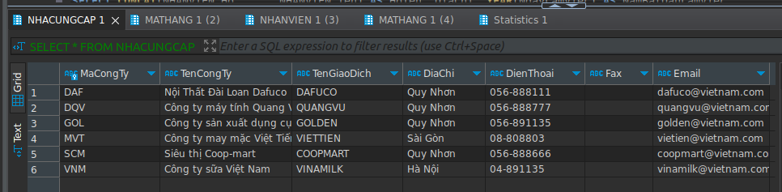
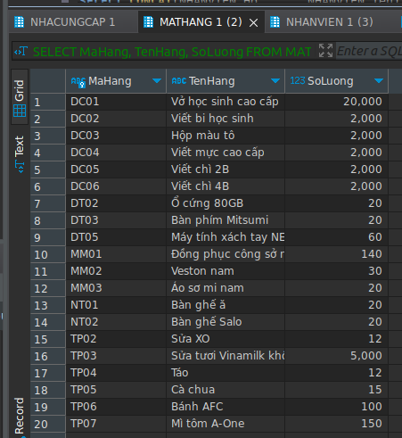
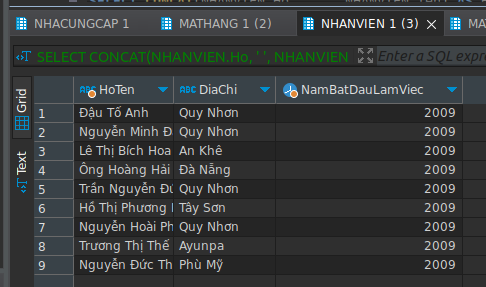
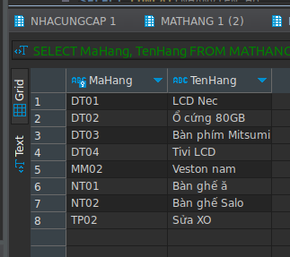
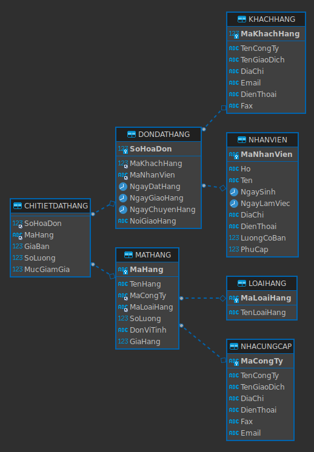

Cho biết danh sách các đối tác cung cấp hàng cho công ty? 

{width="6.6930555555555555in"
height="1.6416666666666666in"}

Mã hàng, tên hàng và số lượng của các mặt hàng hiện có trong công ty có số lượng lớn hơn 10 Cái?

{width="4.697916666666667in"
height="5.114583333333333in"}

Họ tên, địa chỉ và năm bắt đầu làm việc của các nhân viên trong cty? 

{width="5.0625in"
height="2.9895833333333335in"}

Mã và tên của các mặt hàng có giá trị lớn hơn 100000 và số lượng hiện có ít hơn 50?

{width="3.3645833333333335in"
height="2.9895833333333335in"}

Database Diagram

{width="5.395833333333333in"
height="7.770833333333333in"}
